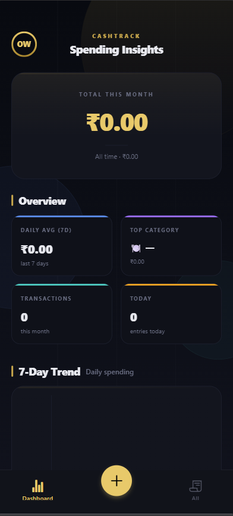
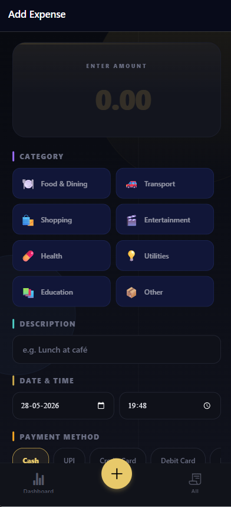

<div align="center">

<!-- Header -->


<br/>

<!-- Badges -->


<br/>

> **CashTrack** is a full-stack mobile expense tracker that helps you monitor spending, categorize transactions, and visualize your financial habits — all in a sleek dark-themed UI.

</div>

---

## 📱 Screenshots

<div align="center">

<table>
  <tr>
    <td align="center">
      
      <br/>
      <b>📊 Spending Dashboard</b>
    </td>
    <td align="center">
      
      <br/>
      <b>➕ Add Expense</b>
    </td>
  </tr>
</table>

</div>

---

## ✨ Features

- 💸 **Track Expenses** — Log transactions with amount, description, date & time
- 🗂️ **8 Smart Categories** — Food & Dining, Transport, Shopping, Entertainment, Health, Utilities, Education, Other
- 💳 **Payment Methods** — Cash, UPI, Credit Card, Debit Card
- 📊 **Spending Insights** — Total monthly spend, daily average, top category
- 📈 **7-Day Trend Chart** — Visual daily spending breakdown
- 🌙 **Dark Theme** — Elegant dark UI with gold accents
- ☁️ **Cloud Sync** — MongoDB Atlas backend keeps your data safe

---

## 🏗️ Tech Stack

| Layer | Technology |
|-------|-----------|
| 📱 Frontend | React Native + Expo |
| ⚙️ Backend | Node.js + Express.js |
| 🗄️ Database | MongoDB (Atlas) |
| 🔌 API | RESTful API |
| 🔐 Config | dotenv |

---

## 📁 Project Structure

```
CashTrack/
├── frontend/          # Expo React Native app
│   └── src/
│       └── utils/
│           └── constants.js   # API_URL config
├── backend/           # Node.js + Express API
│   └── .env           # MONGO_URI, PORT
├── .gitignore
└── README.md
```

---

## 🚀 Getting Started

### Prerequisites
- Node.js ≥ 18
- MongoDB Atlas account (or local MongoDB)
- Expo CLI (`npm install -g expo-cli`)

---

### 🖥️ Backend Setup

```bash
# 1. Navigate to backend
cd backend

# 2. Install dependencies
npm install

# 3. Create .env file
touch .env
```

Add to `.env`:
```env
MONGO_URI=your_mongodb_connection_string
PORT=5000
```

```bash
# 4. Start the server
npm run dev
```

Server runs at `http://localhost:5000` ✅

---

### 📱 Frontend Setup

```bash
# 1. Navigate to frontend
cd frontend

# 2. Install dependencies
npm install

# 3. Set your backend URL
# Open: frontend/src/utils/constants.js
```

```js
export const API_URL = 'https://your-backend-url.com/api';
```

```bash
# 4. Start Expo
npx expo start
```

Scan the QR code with **Expo Go** app on your phone 📲

---

## ☁️ Deploying Online

| Service | Use For |
|---------|---------|
| [Render](https://render.com) / [Railway](https://railway.app) | Backend hosting |
| [MongoDB Atlas](https://cloud.mongodb.com) | Cloud database |
| [Expo EAS](https://expo.dev/eas) | Mobile app build & deploy |

> ⚠️ Update `API_URL` in `constants.js` to your live backend URL before building.

---

## 📌 Notes

- The backend **must be online** for the mobile app to work
- Never commit `node_modules/` or `.env` files
- Use MongoDB Atlas for production — local MongoDB won't be reachable from a deployed app

---

## 👨‍💻 Author

<div align="center">

**Om Wadghule**

[](https://github.com/Om-005)
[](http://www.linkedin.com/in/om-wadghule-2005id)

</div>

---

<div align="center">

⭐ **If you found this useful, give it a star!** ⭐


</div>
